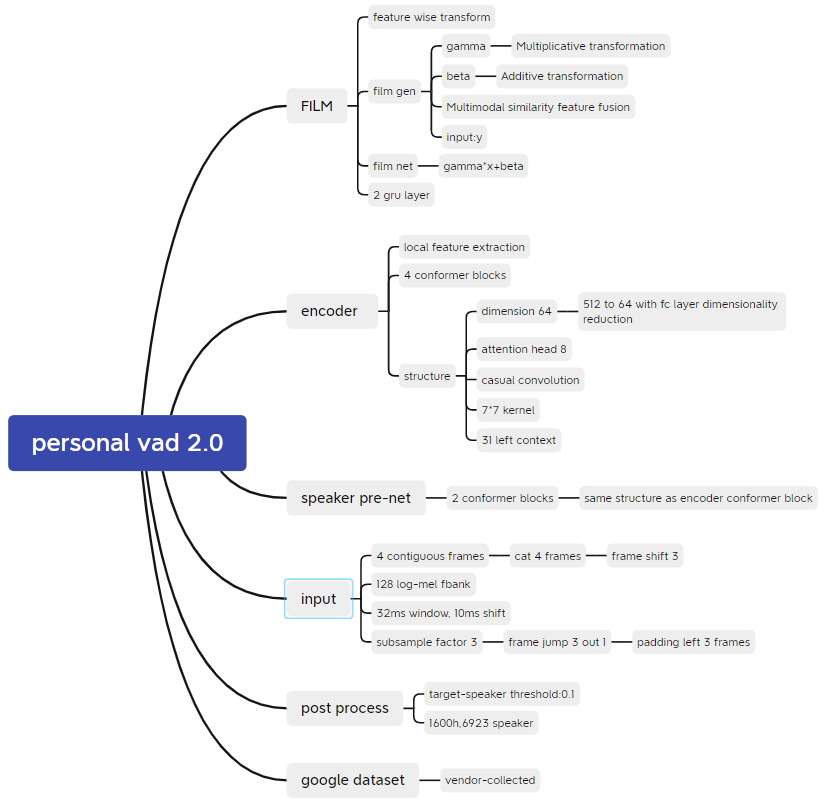

# Personal-vad-2.0

PyTorch implementation of "Personal VAD 2.0: Optimizing Personal Voice
Activity Detection for On-Device Speech Recognition".

The default model follows the paper setup: 512-dim stacked acoustic features,
64-dim Conformer blocks, 4 encoder layers, a 2-layer speaker pre-net, FiLM
conditioning from speaker cosine similarity, and 3 frame classes:

- `0`: target speaker speech
- `1`: non-target speaker speech
- `2`: non-speech



## Install

```bash
pip install -r requirements.txt
```

## Smoke Test

```bash
python tests/smoke_test.py
python train.py --smoke-test --epochs 1 --batch-size 2 --device cpu
```

## Data Manifest

Training uses a JSONL or CSV manifest. Paths are resolved relative to the
manifest file. Features and labels can be `.pt`, `.pth`, `.npy`, or `.npz`.

Example JSONL:

```json
{"id": "utt001", "features": "utt001_feat.pt", "labels": "utt001_labels.pt", "embedding": "utt001_spk.pt"}
{"id": "utt002", "features": "utt002_feat.npy", "labels": "utt002_labels.npy"}
```

Each feature tensor must have shape `(frames, 512)`, each label tensor must have
shape `(frames,)`, and each speaker embedding must have shape `(64,)` by
default. If `embedding` is omitted, the sample is treated as enrollment-less and
uses a zero speaker embedding.

## Train

```bash
python train.py \
  --train-manifest data/train.jsonl \
  --valid-manifest data/valid.jsonl \
  --output-dir runs/pvad2 \
  --epochs 20 \
  --batch-size 16
```

The training loop implements the enrollment-less paradigm from the paper:
with `--enrollment-drop-prob 0.2`, a sampled utterance has its speaker embedding
replaced with zeros and its non-target speech labels (`1`) rewritten to target
speech (`0`). Checkpoints are written to `last.pt` and `best.pt`.

## Speaker Embeddings

The model can consume external speaker embeddings by changing
`--speaker-embedding-dim`. A local smoke test with ModelScope CAM++ works with
192-dim embeddings:

```bash
pip install -r requirements-speaker.txt
python -m speaker_backends.modelscope_export \
  path/to/enrollment.wav \
  --output-dir data/embeddings
```

Then reference the generated `.spk.npy` path from the manifest and train with:

```bash
python train.py \
  --train-manifest data/train.jsonl \
  --speaker-embedding-dim 192
```

For offline use after the first download, pass the local cached model directory
instead of the model id, for example:

```bash
python -m speaker_backends.modelscope_export \
  path/to/enrollment.wav \
  --model C:\Users\alanf\.cache\modelscope\hub\models\iic\speech_campplus_sv_zh-cn_16k-common \
  --output-dir data/embeddings
```
