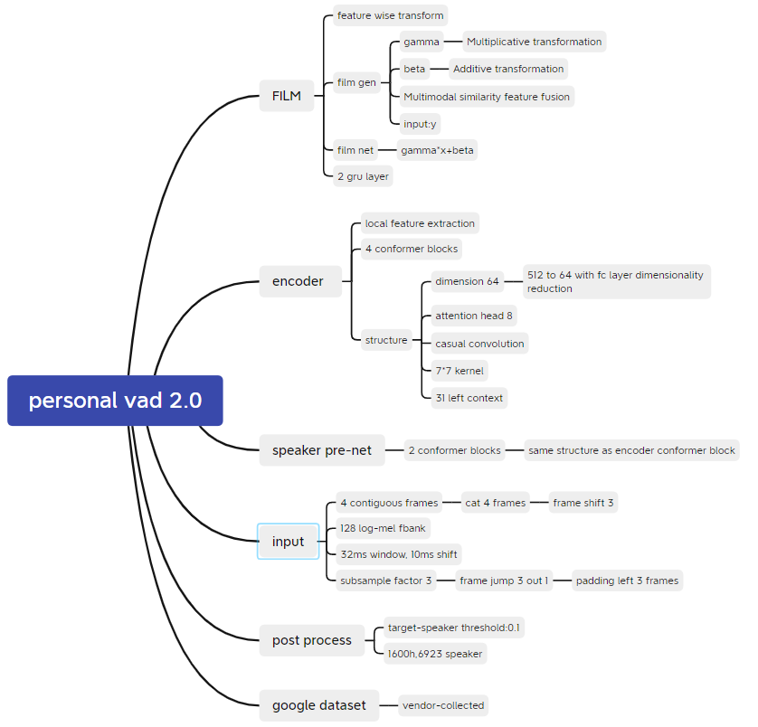

# Personal-vad-2.0

PyTorch implementation of "Personal VAD 2.0: Optimizing Personal Voice
Activity Detection for On-Device Speech Recognition".

The default model follows the paper setup: 512-dim stacked acoustic features,
64-dim Conformer blocks, 4 encoder layers, a 2-layer speaker pre-net, FiLM
conditioning from speaker cosine similarity, and 3 frame classes:

- `0`: target speaker speech
- `1`: non-target speaker speech
- `2`: non-speech



This repository includes the standalone model, deterministic acoustic
frontend, speaker-disjoint mixture generator, CAM++ embedding export/audit,
training and evaluation loops, causal streaming adapter, calibrated target
speech state machine, tests, and a sanitized speaker-aware checkpoint. It does
not include the private Qwen3-Omni duplex service integration, raw datasets,
upstream model weights, enrollment audio, or biometric embeddings.

## Install

```bash
pip install -r requirements.txt
```

For data generation and the test suite:

```bash
pip install -r requirements-dev.txt
```

## Smoke Test

```bash
python tests/smoke_test.py
python train.py --smoke-test --epochs 1 --batch-size 2 --device cpu
```

## Data Manifest

Training uses a JSONL or CSV manifest. Paths are resolved relative to the
manifest file. Features and labels can be `.pt`, `.pth`, `.npy`, or `.npz`.

Example JSONL:

```json
{"id": "utt001", "features": "utt001_feat.pt", "labels": "utt001_labels.pt", "embedding": "utt001_spk.pt"}
{"id": "utt002", "features": "utt002_feat.npy", "labels": "utt002_labels.npy"}
```

Each feature tensor must have shape `(frames, 512)`, each label tensor must have
shape `(frames,)`, and each speaker embedding must have shape `(64,)` by
default. If `embedding` is omitted, the sample is treated as enrollment-less and
uses a zero speaker embedding.

The in-repo `PvadFeatureExtractor` implements the paper-published dimensions:
128 log-Mel energies from a 32 ms window at a 10 ms shift, four contiguous
frames stacked to 512 dimensions, followed by factor-three time subsampling.
The product frontend makes that stack causal (current plus three past frames).
The paper does not publish a CMVN, window, Mel scale, or FFT-size recipe, so
those choices are explicit rather than presented as paper facts: no CMVN,
Hann window, HTK Mel scale, and a 1024-point zero-padded FFT. The complete
`PvadFeatureConfig` must match between data generation and inference.

## Review Data Generation

Install `requirements-data.txt`, then provide speaker-separated AISHELL wavs,
WHAM `tr/cv` noise, persisted Qwen3-Omni TTS response wavs, and local FSMN
VAD/CAM++ model directories:

```bash
python generate_review_set.py \
  --aishell-wav-root /path/to/aishell_subset/wav/train \
  --wham-root /path/to/wham_noise \
  --tts-root /path/to/persisted/page_output \
  --vad-model /path/to/fsmn_vad \
  --campplus-model /path/to/campplus \
  --output-dir /path/to/review100
```

The fixed review plan creates 80 train and 20 dev mixtures with disjoint
speakers. Enrollment uses two utterances that never appear as current audio.
Recipes cover target-only, near/far non-target, overlap, WHAM/high noise, and
TTS playback. Labels encode identity activity only: target wins on overlap,
non-target/TTS speech is class 1, and noise/silence is class 2. No ASR text,
valid/invalid label, or semantic-end label enters this pipeline.

## Train

```bash
python train.py \
  --train-manifest data/train.jsonl \
  --valid-manifest data/valid.jsonl \
  --output-dir runs/pvad2 \
  --epochs 20 \
  --batch-size 16
```

The training loop implements the enrollment-less paradigm from the paper:
with `--enrollment-drop-prob 0.2`, a sampled utterance has its speaker embedding
replaced with zeros and its non-target speech labels (`1`) rewritten to target
speech (`0`). Checkpoints are written to `last.pt` and `best.pt`.
By default, `best.pt` is selected by validation target-class F1 rather than
loss. `--selection-metric macro_f1` and `--selection-metric loss` are
available for controlled comparisons. Metrics include all three per-class
precision/recall/F1/support values, a confusion matrix, macro-F1, and
target-vs-rest approximate PR/ROC summaries. `--max-steps-per-epoch` bounds
20-step batch-size and stability checks without starting a long run.

The complete reference pipeline and exact pilot4k commands are in
[`docs/TRAINING.md`](docs/TRAINING.md).

## Streaming Inference

`PvadStreamingAdapter` accepts arbitrary mono-audio chunks and returns aligned
three-class logits/probabilities. The audio frontend already applies factor-three
time subsampling, so the corresponding model must use `subsampling='linear'`.
Each Conformer layer keeps bounded attention K/V and causal-convolution caches.

```python
import torch

from model import Pvad2
from streaming import PvadStreamingAdapter

model = Pvad2.load_model('best.pt').eval()
embedding = torch.from_numpy(campplus_embedding)
adapter = PvadStreamingAdapter(
    model, embedding, device='cuda', measure_rtf=False)
output = adapter.feed_audio(mono_pcm_chunk)
target_probability = output.probabilities[:, 0]
```

Set `measure_rtf=True` only for benchmarking: CUDA synchronization is then
included in the reported cumulative real-time factor. Call `reset()` at an
utterance/session boundary; changing batch size or reusing caches across
independent audio is rejected. Feed the returned probabilities and aligned
frames into `TargetSpeechStateMachine` from `postprocessing.py` for the
published deployed-style onset/release policy.

## Speaker Embeddings

The model can consume external speaker embeddings by changing
`--speaker-embedding-dim`. A local smoke test with ModelScope CAM++ works with
192-dim embeddings:

CAM++ is open source as part of the
[ModelScope 3D-Speaker](https://github.com/modelscope/3D-Speaker) project
(Apache-2.0). The exact upstream model used here is
[`iic/speech_campplus_sv_zh-cn_16k-common`](https://modelscope.cn/models/iic/speech_campplus_sv_zh-cn_16k-common).
This repository does not bundle CAM++ weights; it consumes the 192-dimensional
embeddings produced by the upstream model.

```bash
pip install -r requirements-speaker.txt
python -m speaker_backends.modelscope_export \
  path/to/enrollment.wav \
  --output-dir data/embeddings
```

Then reference the generated `.spk.npy` path from the manifest and train with:

```bash
python train.py \
  --train-manifest data/train.jsonl \
  --speaker-embedding-dim 192
```

For offline use after the first download, pass the local cached model directory
instead of the model id, for example:

```bash
python -m speaker_backends.modelscope_export \
  path/to/enrollment.wav \
  --model path/to/modelscope/cache/iic/speech_campplus_sv_zh-cn_16k-common \
  --output-dir data/embeddings
```

## Trained speaker-aware example

The repository includes the sanitized epoch-38 pilot4k checkpoint and an
end-to-end example using external CAM++ enrollment embeddings and the
published dev-calibrated target-speech FSM:

```bash
python -m speaker_backends.modelscope_export \
  enrollment_1.wav enrollment_2.wav \
  --output-dir data/enrollment

python examples/pilot4k_speaker_aware_inference.py \
  --audio current.wav \
  --embedding data/enrollment/enrollment_1.spk.npy \
  --embedding data/enrollment/enrollment_2.spk.npy \
  --output pvad_result.json
```

See the
[checkpoint model card](checkpoints/pilot4k_speaker_aware_epoch38/README.md)
for the exact data recipe, split counts, label construction, checksums,
validation metrics, and limitations. Aggregate source and evaluation metadata
are in `metadata/DATASET_SUMMARY.json` and `metadata/DEV_METRICS.json`.

## License and data terms

Repository source code is Apache-2.0. External software, model weights, source
audio, generated TTS, and the published checkpoint remain subject to their
applicable upstream terms. In particular, the reference recipe used WHAM!
noise under CC BY-NC 4.0. See [`THIRD_PARTY.md`](THIRD_PARTY.md) before
redistribution or commercial use.
